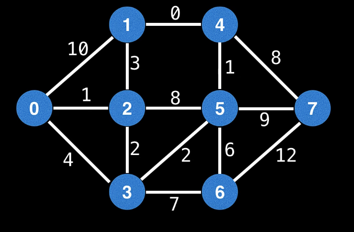

# Assignment 1, C++
### 318790169, Shachar Tsrafati, Shachar.ts1@gmail.com

### Note This assignment supports (and tested on)
-[x] C++ version 17, g++ version <br />
-[x] g++ (Rev3, Built by MSYS2 project) 14.2.0 on windows <br />
-[x] g++ (Ubuntu 13.3.0–6ubuntu2~24.04) 13.3.0 on linux.

[makefile](makefile)<br />
```make main``` : run make on main.cpp <br/>
```make test``` : run make on test.cpp <br/>
```make valgrind```: run make with valgrind on test.cpp and run it <br/>
```make clean```: clean out files and executable files

[Node.hpp](Node.hpp) — Header file for building the nodes for the graph and algorithm

[PQueue.hpp](PQueue.hpp) — Header file for priority queue implementation

[UnionFind.hpp](UnionFind.hpp) — Header file for union-find data structure

[Graph.hpp](Graph.hpp) — Header file for the graph class

[Algorithms.hpp](Algorithms.hpp) — Header file for graph algorithms (Bfs,Dfs,Dijkstra,Prim and Kruskal)


# Premade graph for testing
